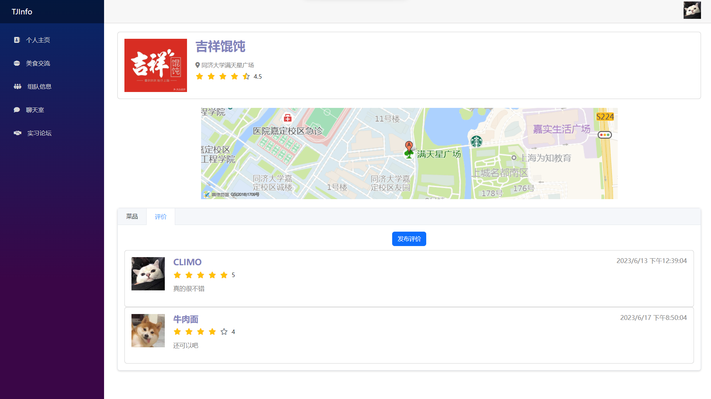

# TJInfo - 项目简介

2054015 李怿欣 2053291 刘兴源

## 1. 项目介绍

本项目名称为”TJInfo“，是一款为同济大学同学设计的Web校园信息交流平台，使用 Blazor WebAssembly 框架构建。该平台旨在为校园内的学生提供一个便捷、实用的信息分享和交流平台，主要包括以下五个模块：美食、组队、实习信息、实时聊天室和后台管理。

- 美食交流：学生可以查找校内和周边的美食，发布评价并对菜品和商户进行评分。
- 组队信息交流：旨在帮助校园内的学生寻找和组建合适的团队。学生可以在组队广场浏览现有的团队信息，了解项目详情并选择加入队伍，也可以创建自己的团队或加入其他团队，以共同完成各种项目、比赛或娱乐活动等。
- 实习信息论坛：该模块提供实习信息的交流论坛，学生可以在论坛中与其他同学讨论实习、租房情况，分享面试经验和实习信息。
- 实时聊天室：为学生提供了一个在线交流和社交的平台。用户可以加入聊天室，与其他用户进行实时的文字交流。这个模块提供了一个友好和互动的环境，促进校园内学生之间的交流和联系。
- 后台管理：后台管理模块是管理员使用的界面，用于管理后台信息。管理员主要对于美食模块的商户和菜品信息进行管理，包括发布、修改和删除等操作。

## 2. 使用手册

### 2.1 登录

### 2.2 注册

### 2.3 美食交流

点击商户即可跳转至商户详情，详情界面展示商户的具体位置和综合评分，商家的菜品以及其他同学的评价。

点击发布评价可以对当前商户进行评价。

点击商家下的具体菜品可查看菜品详细情况以及用户评价

点击发布评论可对菜品进行评价

### 2.4 组队信息

在组队广场可以查看当前正在寻找队友的队伍信息，包括分类、截止时间、人数情况等。点击加入队伍按钮，如果人数未满即可加入队伍。

点击我创建的队伍可以查看所有我发布的队伍信息以及加入的人员手机号，同时可以进行踢出、解散队伍的操作。

点击我加入的队伍可以查看所有加入的队伍信息，点击退出队伍即可离开队伍。

### 2.5 聊天室

不同的账号可以在聊天室中实时聊天。

### 2.6 实习论坛

### 2.7 个人主页

### 2.8 后台管理

## 3. 代码结构

本项目使用了 Blazor 框架进行前端开发，通过使用 C# 和 .NET 技术栈，实现前后端的协作和数据交互。

## 4. 数据库设计