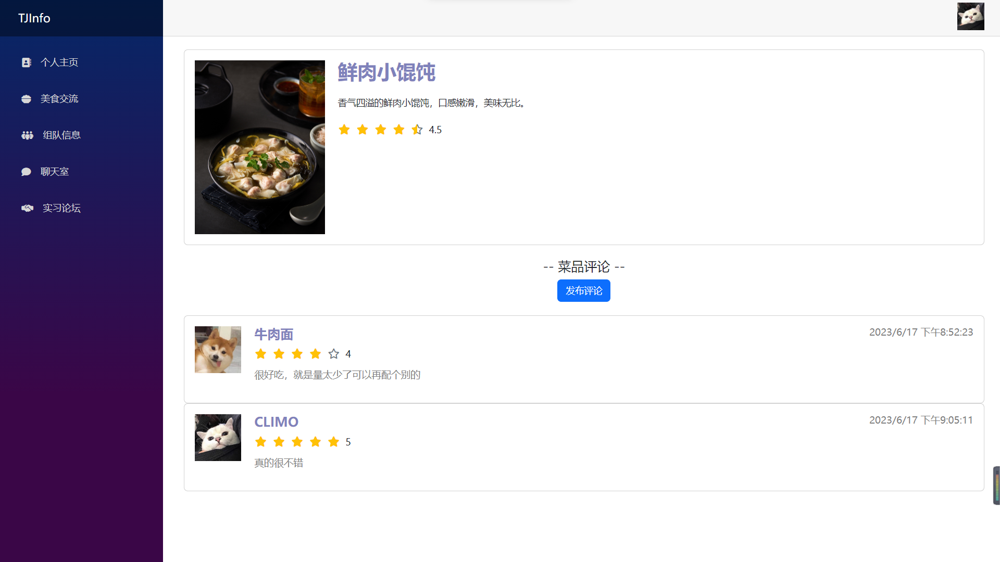

# TJInfo - 项目简介

2054015 李怿欣 2053291 刘兴源

## 1. 项目介绍

本项目名称为”TJInfo“，是一款为同济大学同学设计的Web校园信息交流平台，使用 Blazor WebAssembly 框架构建。该平台旨在为校园内的学生提供一个便捷、实用的信息分享和交流平台，主要包括以下五个模块：美食、组队、实习信息、实时聊天室和后台管理。

- 美食交流：学生可以查找校内和周边的美食，发布评价并对菜品和商户进行评分。
- 组队信息交流：旨在帮助校园内的学生寻找和组建合适的团队。学生可以在组队广场浏览现有的团队信息，了解项目详情并选择加入队伍，也可以创建自己的团队或加入其他团队，以共同完成各种项目、比赛或娱乐活动等。
- 实习信息论坛：该模块提供实习信息的交流论坛，学生可以在论坛中与其他同学讨论实习、租房情况，分享面试经验和实习信息。
- 实时聊天室：为学生提供了一个在线交流和社交的平台。用户可以加入聊天室，与其他用户进行实时的文字交流。这个模块提供了一个友好和互动的环境，促进校园内学生之间的交流和联系。
- 后台管理：后台管理模块是管理员使用的界面，用于管理后台信息。管理员主要对于美食模块的商户和菜品信息进行管理，包括发布、修改和删除等操作。

## 2. 使用手册

### 2.1 登录

### 2.2 注册

### 2.3 美食交流

点击商户即可跳转至商户详情，详情界面展示商户的具体位置和综合评分，商家的菜品以及其他同学的评价。

点击发布评价可以对当前商户进行评价。

点击商家下的具体菜品可查看菜品详细情况以及用户评价

点击发布评论可对菜品进行评价

### 2.4 组队信息

在组队广场可以查看当前正在寻找队友的队伍信息，包括分类、截止时间、人数情况等。点击加入队伍按钮，如果人数未满即可加入队伍。

点击我创建的队伍可以查看所有我发布的队伍信息以及加入的人员手机号，同时可以进行踢出、解散队伍的操作。

点击我加入的队伍可以查看所有加入的队伍信息，点击退出队伍即可离开队伍。

### 2.5 聊天室

不同的账号可以在聊天室中实时聊天。

### 2.6 实习论坛

查看当前论坛中的所有帖子，点击详情可以进入详情页面。

点击加号可以发布帖子。

自己发布的帖子可以点击删除按钮进行删除操作。

详情页面中可以看到其他用户对于帖子的回复。

点击回复帖子或回复评论即可进行回复操作。

对于自己发布的评论可以点击删除。

### 2.7 个人主页

个人主页中可以查看个人信息，修改个人信息和修改密码。

下方的标签页可以查看我对于商家的评价和对于菜品的评价，点击删除按钮可以进行删除操作。

点击顶部右上角头像可以退出登录。

### 2.8 后台管理

我们设定特定管理员账号能够在Login页面登入管理员系统。

顶部右上角点击头像可以退出登录。

管理员可以查看商家信息、添加商家、修改商家信息和删除商家。

管理员还可以查看菜品信息、添加菜品、修改菜品信息和删除菜品。

## 3. 代码结构

本项目使用了 Blazor 框架进行前端开发，通过使用 C# 和 .NET 技术栈，实现前后端的协作和数据交互。

关于我们后端的代码：在后端，我们采用了DB First的设计模式，因此在Shared模块中，存放有我们的实体集。针对不同的实体集，我们在server程序集中实现了不同的Service与IService，用来封装对表的操作。后端还包含Controller来作为前后端之间的接口，方便前端调用后端特定的服务。

关于我们前端的代码：在前端，我们使用了Blazor框架进行开发。针对不同的实体，我们也封装了不同的Service和IService，用于调用相应的接口。在razor组件中只需要注入相关服务，然后在code模块调用相关服务内容即可。

除此之外，我们还引入了DLL和CLR两个程序集，分别实现了返回一个随机头像数组下标和加法操作。

## 4. 数据库设计

我们的数据库共有9张表，ER图情况如下

